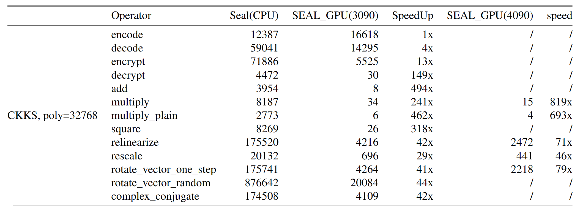

## Article
We have summarized our design of the project, which can be found in https://arxiv.org/abs/2503.22227


***English:***

# FHE GPU Acceleration Library
**This project is based on the framework of [Microsoft SEAL library](https://github.com/microsoft/SEAL), and the original interface is completely retained**

Users do not need to modify the code as you are using the original SEAL, and can directly benifit from this project for GPU acceleration calculation.

## Acceleration 

Some tests on Nvidia 4090 are under going, and will be updated soon.

More details and test results will be found in our incoming paper.

## Preparation
1. Install CUDA
    Download and install CUDA 11.7
    https://developer.nvidia.com/cuda-11-7-0-download-archive

2. Install CMake
    Install CMake 3.18.3

## Compilation
Execute in the root directory
```
cmake -S . -B build
cd build
make 
```

Test:
```
cd build/bin
./sealexamples
```

***中文：***
# FHE GPU加速库
**该项目基于[微软SEAL库](https://github.com/microsoft/SEAL)框架进行完成，完全保留原有接口**

用户无需修改原有使用SEAL时的代码，可以直接使用本项目进行GPU加速计算。


## 加速效果
部分Nvidia 4090上的测试正在进行，将会在近期更新。

更多细节和测试结果将会在我们即将发表的论文中公布。

## 准备操作
1. 安装CUDA
    下载安装11.7版本CUDA 
    https://developer.nvidia.com/cuda-11-7-0-download-archive
2. 安装CMake
    安装3.18.3版本cmake


## 编译方法
根目录下执行
```
cmake -S . -B build
cd build
make 
```

测试：
```
cd build/bin
./sealexamples
```

